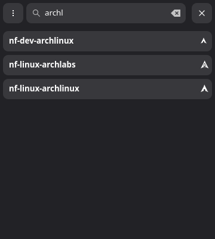

# Nerd font search gtk

Simple gtkmm application for searching nerd font icons


The list of icons is taken [from this page](https://www.nerdfonts.com/cheat-sheet)

### Compilation

```
g++ main.cpp -o nf-search-gtk `pkg-config --cflags --libs gtkmm-4.0`
cp org.ntri12.nf-search.gschema.xml ~/.local/share/glib-2.0/schemas/org/ntri12.nf-search.gschema.xml
glib-compile-schemas ~/.local/share/glib-2.0/schemas/
```
